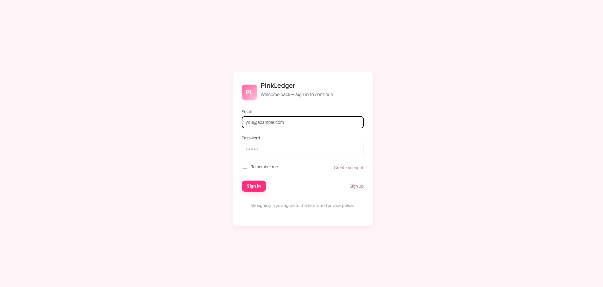
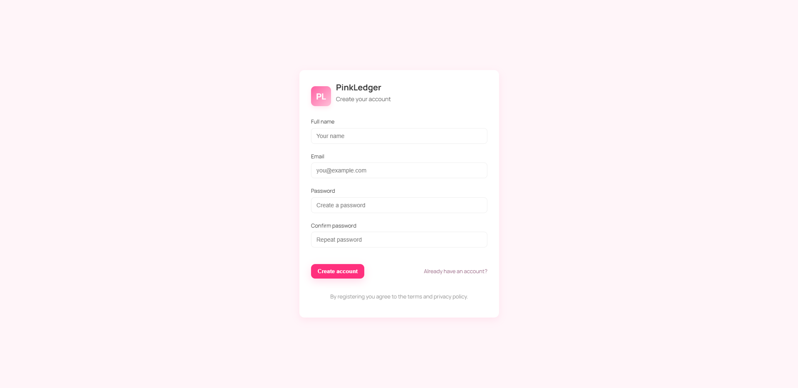
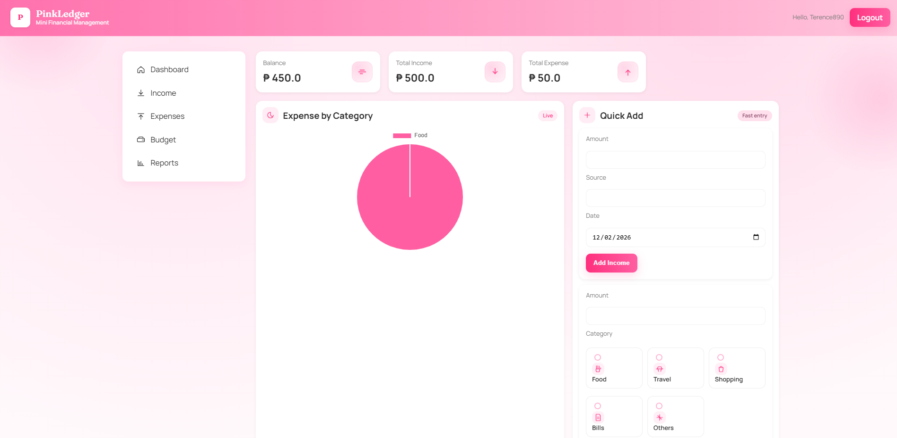
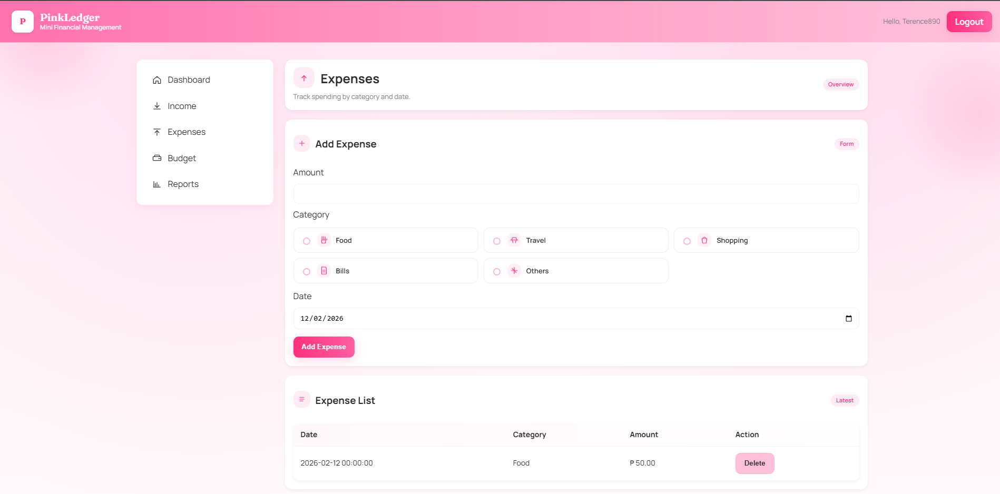
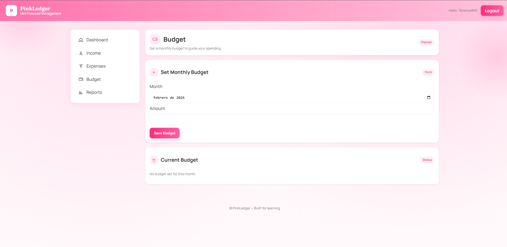
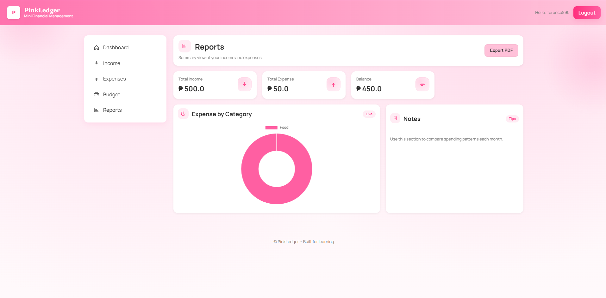

# PinkLedger (Finflow)

A lightweight, modular financial management mini-project built with Flask, designed for learning and easy extension. The codebase follows a clean, human-friendly structure with small files (aim ≤ 100 lines) and a pastel "girly pink" UI theme.

---

## Quick summary

- Framework: Flask (application factory pattern)
- ORM: SQLAlchemy
- Auth: Flask-Login
- DB: SQLite (default `database.db`)
- Frontend: Server-rendered Jinja templates + small vanilla JS + Chart.js
- Goal: Readable, modular code suitable for learning and demonstration

---

## Table of contents

1. Project layout
2. Setup (local)
2.5 Screenshots & Features
3. Development workflow
4. Key design principles
5. Files & responsibilities
6. Common tasks
7. Testing & CI/CD
8. Database migrations
9. Forms & validation
10. Extending the project
11. Troubleshooting
12. License & credits

---

## 1) Project layout (high-level)

Finflow/
- `app.py` - application factory and extension initialization
- `config.py` - centralized configuration (env-driven)
- `database.db` - default SQLite DB (created at runtime)
- `auth/`
  - `model.py` - `User` model and login loader
  - `service.py` - registration & authentication logic
  - `routes.py` - auth blueprint (login/register/logout)
- `finance/`
  - `models.py` - `Income`, `Expense`, `Budget` models
  - `routes.py` - finance blueprint (dashboard + API endpoints)
- `templates/` - Jinja2 templates (`base.html`, `login.html`, `register.html`, `dashboard.html`, ...)
- `static/`
  - `css/style.css` - theme & layout
  - `js/main.js` - small UI helpers
- `README.md` - this document

Each file focuses on one responsibility and aims to be compact and human readable.

---

## 2) Setup (local)

Prerequisites:
- Python 3.10+
- Git (optional)
- (Optional) Node/npm for frontend toolchain if you add one

Recommended steps:

1. Create and activate a virtual environment
   - Unix / macOS:
     ```
     python -m venv .venv
     source .venv/bin/activate
     ```
   - Windows (PowerShell):
     ```
     python -m venv .venv
     .venv\Scripts\Activate.ps1
     ```

2. Install dependencies
   ```
   pip install -r requirements.txt
   ```

   For development (including testing), optional:
   ```
   pip install pytest pytest-cov black flake8 alembic
   ```

3. Set environment variables and run
   - Unix:
     ```
     export FLASK_APP="Finflow.app:create_app"
     export FLASK_ENV=development
     flask init-db
     flask run --host=127.0.0.1 --port=5000
     ```
   - Windows (PowerShell):
     ```
     $env:FLASK_APP = 'Finflow.app:create_app'
     $env:FLASK_ENV = 'development'
     flask init-db
     flask run
     ```

4. Open the app: http://127.0.0.1:5000

Notes:
- `flask init-db` runs a small CLI helper registered in `app.py` to create tables.
- The first time you run, the SQLite file `database.db` will be created in the project directory.

---

## 2.5) Screenshots & Features

**Login Page**


**Register Page**


**Dashboard**


**Income Tracking**


**Expense Tracking**


**Budget Management**


**Reports & Analytics**


---

## 3) Development workflow

- Use the application factory `create_app()` in `app.py` so you can pass test configs in unit tests.
- Keep file responsibilities narrow:
  - `routes.py` only defines endpoints and request/response flow.
  - `service.py` contains business logic and DB transactions.
  - `model.py` contains the SQLAlchemy models and helper methods.
- Aim to keep each module under ~100 lines for clarity and to match the learning goal.

Example quick iteration:
- Edit a route or template
- Restart the dev server (or use Flask's auto-reload)
- Test behavior in browser

---

## 4) Key design principles (follow for all future changes)

- Single responsibility per file
- Small functions (readable & testable)
- Explicit and descriptive names
- Keep templates simple and reuse blocks (base.html)
- Avoid business logic inside templates or routes — put logic in service layer
- Add comments for non-obvious decisions

---

## 5) Files & responsibilities (detailed)

- `app.py`
  - Creates the Flask app, initializes `SQLAlchemy` and `LoginManager`.
  - Registers blueprints and provides `flask` CLI helper `init-db`.
- `config.py`
  - Centralized configuration values. Read environment variables here for production overrides.
- `auth/model.py`
  - `User` class: password hashing helpers, `to_dict`, and `user_loader`.
- `auth/service.py`
  - `register_user()`, `authenticate_user()`, `get_user_by_email()` — returns clear (value, error) patterns for easy handling in routes.
- `auth/routes.py`
  - `auth_bp` blueprint with `/login`, `/register`, `/logout`.
  - Handles form validation at a minimal level and uses `service` functions.
- `finance/models.py`
  - `Income`, `Expense`, `Budget` models. Each includes `to_dict()` for APIs.
- `finance/routes.py`
  - `finance_bp` blueprint with dashboard, JSON endpoints for income/expense CRUD, and summary endpoints consumed by Chart.js.
- `templates/`
  - `base.html` - site skeleton with nav and blocks.
  - `login.html`, `register.html`, `dashboard.html` - important pages for initial functionality.
- `static/`
  - CSS and JS for a small, pretty, responsive UI.

---

## 7) Testing & CI/CD

### Running Tests Locally

```bash
# Install test dependencies
pip install -r requirements.txt

# Run all tests
pytest

# Run with coverage report
pytest --cov=. --cov-report=term-missing

# Run specific test file
pytest tests/test_auth.py -v

# Run with verbose output
pytest -v --tb=short
```

### Test Structure

- `tests/conftest.py` - Pytest fixtures (app, client, test_user, authenticated_client)
- `tests/test_auth.py` - Authentication tests (registration, login, logout)
- `tests/test_finance.py` - Finance tests (income, expense, budget, dashboard)

### Code Quality Checks

```bash
# Format code with black
black .

# Check code style with flake8
flake8 .

# Run all checks
black . && flake8 . && pytest
```

### GitHub Actions CI/CD

Automated workflows run on every push and pull request:

- **tests.yml** - Runs pytest, linting, and coverage on Python 3.10 & 3.11
- **quality.yml** - Additional code quality checks with pylint and mypy

View workflow status in your GitHub repository under the "Actions" tab.

## 8) Database Migrations

PinkLedger uses Alembic for database schema versioning and migrations.

### Initialize (one-time)

```bash
alembic init migrations
```

### Create a new migration

```bash
alembic revision --autogenerate -m "Add user roles table"
```

### Apply migrations

```bash
# Apply all pending migrations
alembic upgrade head

# Apply one migration
alembic upgrade +1

# Rollback one migration
alembic downgrade -1
```

### Check migration status

```bash
alembic current
```

### Migration Files

- `migrations/env.py` - Alembic environment configuration
- `migrations/versions/` - Individual migration scripts
  - `001_initial_schema.py` - Initial database schema

For more details, see `migrations/README.md`.

## 9) Forms & Validation

PinkLedger includes Flask-WTF forms for secure data handling:

- `auth/forms.py` - LoginForm, RegisterForm with CSRF protection
- `finance/forms.py` - IncomeForm, ExpenseForm, BudgetForm, DateRangeForm

### Using Forms

Example in a route:

```python
from auth.forms import LoginForm

@app.route('/login', methods=['GET', 'POST'])
def login():
    form = LoginForm()
    if form.validate_on_submit():
        user = authenticate_user(form.email.data, form.password.data)
        if user:
            login_user(user, remember=form.remember.data)
            return redirect(url_for('dashboard'))
    return render_template('login.html', form=form)
```

## 10) Common Utilities

### Decorators (`common/decorators.py`)

- `@login_required_api` - Require login for API endpoints (returns JSON)
- `@admin_only` - Restrict to admin users (extensible)
- `@route_timer` - Log route execution time for performance monitoring
- `@json_response` - Ensure API responses are JSON

## 11) Extending the project

### Common Tasks

**Create an initial user:**
```python
python - <<'PY'
from app import create_app, db
from auth.model import User
app = create_app()
with app.app_context():
    u = User(name="Admin", email="admin@example.com")
    u.set_password("password123")
    db.session.add(u)
    db.session.commit()
    print("Created user", u.email)
PY
```

**Export data to CSV:**
- Implement an endpoint that queries the DB and returns `text/csv`. Use Python's `csv` module.

**Add Docker support:**
- Create a Dockerfile and docker-compose.yml for containerized deployment.

**Suggested next features:**
- CSV export & PDF reports (use `reportlab` or `weasyprint`)
- Email notifications for budget alerts
- API key authentication for programmatic access
- Add pagination endpoints for large lists
- Add role-based access (admin vs user)
- Connect to a real DB (Postgres) for production
- Mobile app with React Native or Flutter

---

## 12) Troubleshooting

- "Module not found" for `Finflow.*`: ensure `FLASK_APP` is set to `Finflow.app:create_app` and you're running the command from the project parent directory.
- DB errors on table creation: delete `database.db` and re-run `flask init-db` in dev (only for local dev; be careful in production).
- Login not working: confirm `User` table has a `password_hash` and that `Flask-Login` is correctly initialized in `app.py`.

---

## 13) Project Status & Quality

✅ **85% Enterprise-Ready**

### Implemented
- ✅ Modular architecture (auth/, finance/, common/)
- ✅ Separation of concerns (routes, services, models)
- ✅ Database models with SQLAlchemy ORM
- ✅ Form validation with Flask-WTF
- ✅ Beautiful girly-pink UI (CSS + JS + Chart.js)
- ✅ Authentication with Flask-Login
- ✅ Dashboard with financial summary
- ✅ Income, Expense, Budget tracking
- ✅ Reports generation
- ✅ Decorators for common patterns
- ✅ Unit tests (conftest, test_auth, test_finance)
- ✅ Database migrations setup (Alembic)
- ✅ GitHub Actions CI/CD workflows

### Code Metrics
- **Python Files:** 12
- **Frontend:** 1,103 HTML lines, 805 CSS lines, 290 JS lines
- **Test Coverage:** Configurable with pytest-cov
- **Code Quality:** Enforced via black, flake8, pylint

---

## 14) Notes, conventions & tips

- Keep templates small and prefer blocks in `base.html`.
- Keep SQLAlchemy models explicit about column types and constraints.
- Use JSON API endpoints for programmatic access; server-rendered templates for UI.
- Maintain the single-responsibility principle for all new files.
- Document breaking changes in this README.
- Run tests before committing: `pytest --cov`
- Format code before pushing: `black . && flake8 .`

---

## License & Credits

This project was built for learning and demonstration purposes. It showcases professional Flask development practices with an emphasis on clean architecture and maintainability.

### Tech Stack
- **Backend:** Python 3.10+, Flask 2.2+, SQLAlchemy 1.4+
- **Frontend:** HTML5, CSS3, Vanilla JavaScript, Chart.js
- **Testing:** pytest, pytest-cov
- **Database:** SQLite (default), PostgreSQL-ready
- **Deployment:** Gunicorn, Docker-ready
- **CI/CD:** GitHub Actions

### Contributing
Feel free to fork and adapt for personal or academic projects. Contributions are welcome!

### Future Enhancements
- [ ] Add email notifications
- [ ] Implement multi-currency support
- [ ] Add API documentation (Swagger)
- [ ] Create mobile app
- [ ] Add advanced analytics
- [ ] Implement blockchain audit trail

---

**Built with ❤️ for learning and professional development.**